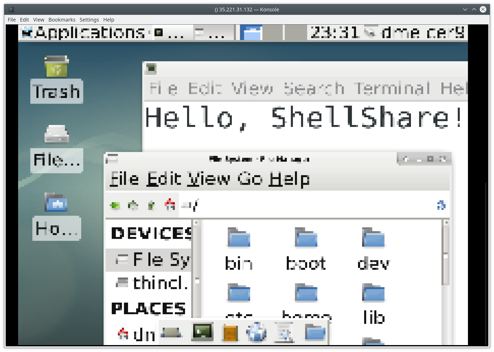

# ShellShare

Project for HackMIT 2019.

Yes, that is a screenshot of a terminal.

Yes, this is a functional screen-sharing piece of software that runs entirely through SSH using ANSI escape sequences.

Yes, it transmits key presses and mouse clicks to the remote machine.

No, it probably shouldn't be used in real life.

----

If you want to use it anyways:
 - You can technically share the screen of a computer to itself, but please don't. 
 Bad things might happen if you click or type inside the screenshare.
 - Clone this repository to the computer you want to see the screen of. 
 - Check the value of the DISPLAY environment variable. If it's empty, open up a remote desktop session 
 (with real rdp software) or log in to the physical computer and check the DISPLAY variable from there.
 - Edit the run script to set DISPLAY equal to the correct number.
 - SSH into the remote computer, and run `./run`.
 - Java needs to be installed.
 - Only some keypresses actually transmit. All the alphanumeric ones work, but special characters cause issues,
 especially if you need to press shift to type it. Arrows maybe work depending on how the software is feeling.
 - Mouse clicks only work in the top left part of the terminal and may be slightly misaligned.
  The spec for handling mouse clicks in the terminal
 is weird and ambiguous once you get high enough x and y values. Also, dragging the mouse doesn't work.
 - Resizing the window works fine, but you might need to wait a second or two for it to adjust the screen size
 and scaling to your terminal.
 - The code is really bad due to it being from a hackathon and changing the ideas of what to write a few times.
 A production-ready version would probably require almost a complete rewrite.